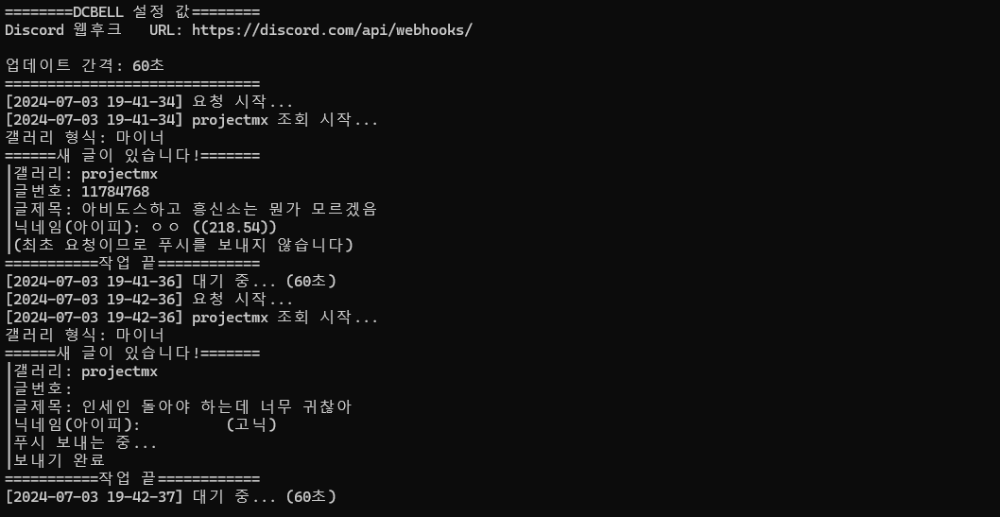
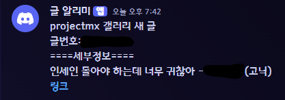

# dcbell-python


디시인사이드(dcinside) 갤러리의 새 글을 실시간으로 디스코드 웹후크를 사용하여 채팅방에 전송해 주는 스크립트

## 사용 방법

1. 서버 설정 → 연동 → 웹후크

2. 새 웹후크 생성 후 웹후크 URL 복사

```
# 웹후크 설정 
discord_webhook_url = "https://discord.com/api/webhooks/xxxxxxxxxxxxxxxxxxxxxxxxxxxxx" #웹후크 URL
# 갤러리 설정 {'갤러리ID': 최근 글 번호}
gallery = {'gall1':0, 'gall2':0}
updTime = 60 # 업데이트 주기 (초)
```
2. 1.의 내용을 바탕으로 main.py 에서 위의 값을 원하는 설정으로 바꿉니다.
갤러리는 딕셔너리 형식이므로 {'gall1': 111, 'gall2':222, 'gall3':345, ...} 와 같은 식으로 1개 이상 적어주시면 됩니다.
<br/><sup>업데이트 주기(updTime)는 초 단위이며, 부하를 막기 위해 최소 1분 이상으로 지정해 주시기 바랍니다.</sup> <br/><br/>



3. 알림 받을 채널을 설정 후 채팅방에 정상적으로 채팅이 오는지 확인합니다.
<br/><br/>


